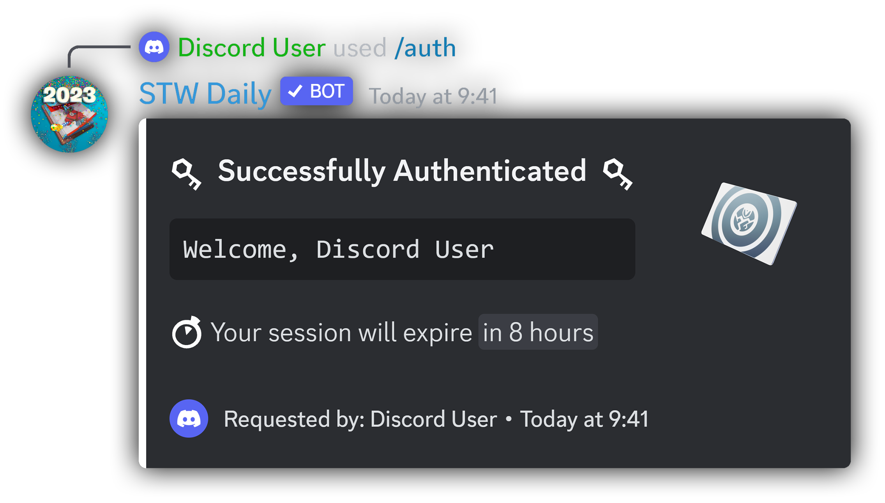
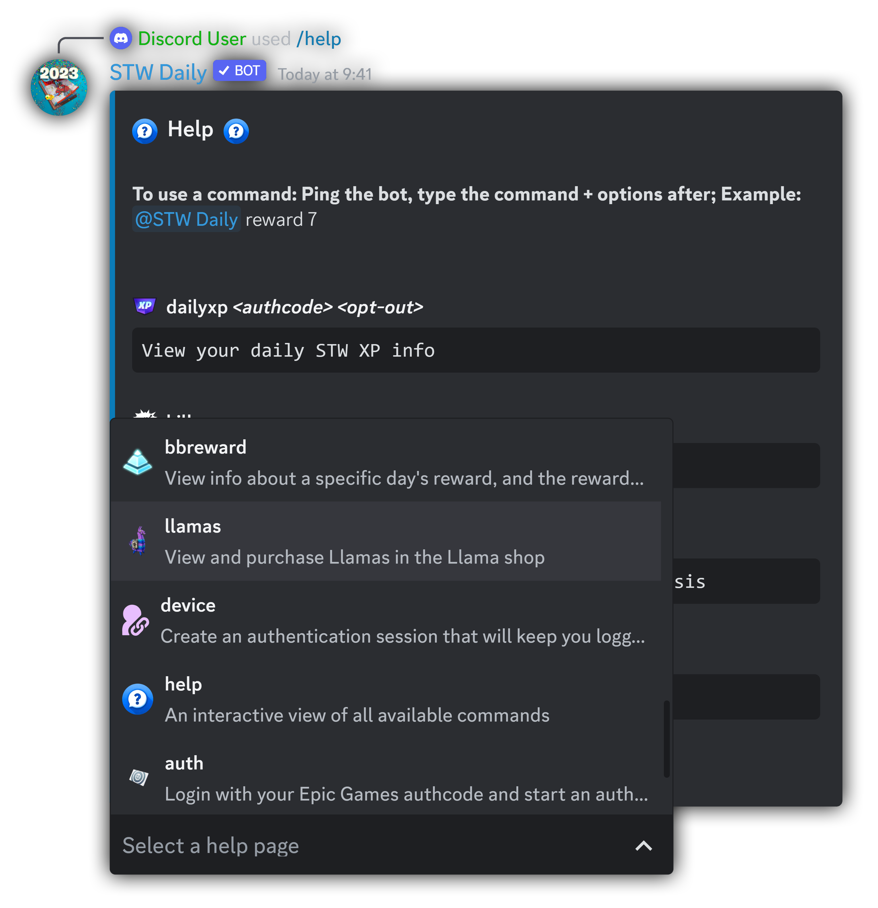
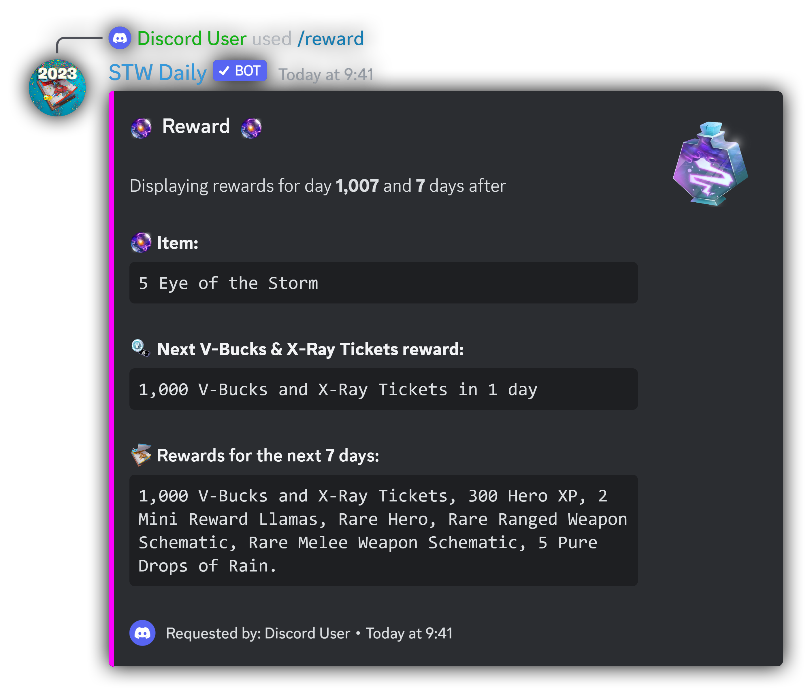

<br />
<div align=center>
    <a id="back-to-top"></a>
    <div align="center">
        <a href="https://github.com/dippyshere/stw-daily">
            
        
        </a>
    </div>
  <h4> A Discord bot for all of your Fortnite: Save the World needs</h4>
</div>

___

<h6 align=center> Auto-claim daily rewards, research points, llamas, and more!</h6>
<div align=center>
<a href="https://discord.com/api/oauth2/authorize?client_id=757776996418715651&permissions=2147797056&scope=bot%20applications.commands"></a>
<a href="https://discord.gg/stw-dailies-757765475823517851"></a>

<a href="https://paypal.me/AHanson047"></a>
<a href="https://ko-fi.com/dippyshere"></a>\

<h4>
<a href="#commands2">Commands</a>
•
<a href="#how-to-use">How to use</a>
•
<a href="#authcode">Getting an Auth Code</a>
•
<a href="#supprot">Support</a>
•
<a href="#credit">Credits</a>
•
<a href="#inf">Info</a>
</h4>
</div>  

___


___

## Commands <a id="commands2"></a>

<span>There are two ways to use most commands with STW Daily:</span>
<ol>
    <li>Mentioning the bot:</li>
<div>
    <picture>
      <source media="(prefers-color-scheme: dark)" srcset="res/stwmentiondark.svg" type="svg">
      <source media="(prefers-color-scheme: light)" srcset="res/stwmentionlight.svg" type="svg">
      
    </picture> <sup>{command} {parameters}</sup>
<li>
    Using <a href="https://discord.com/blog/slash-commands-are-here" target="_blank">slash commands</a>:
</li>
<kbd>/{command}</kbd>
</div>
</ol>
<p>To use a command you want, replace {command} with the name of the command, and {parameters} with any parameters needed.
<p><b>Click on the names of commands below to see examples of how to use them.</b></p>

<details>
    <summary><b>Daily</b></summary>
    <ul>
    <p>This command will instantly claim your daily reward, if available. To use this command, you'll need Fortnite: Save the World on the account you will claim with.</p>
    <span>There are two ways to use this command:</span>
        <ol>
            <li>Mentioning the bot:</li>
        <div>
            <picture>
              <source media="(prefers-color-scheme: dark)" srcset="res/stwmentiondark.svg" type="svg">
              <source media="(prefers-color-scheme: light)" srcset="res/stwmentionlight.svg" type="svg">
              
            </picture> <sup>daily {token} {opt-out}</sup>
        <li>
            Using <a href="https://discord.com/blog/slash-commands-are-here" target="_blank">slash commands</a>:
        </li>
        <kbd>/daily token:{token} auth_opt_out:{opt-out}</kbd>
        </div>
        <br>
        </ol>
        <p>Replace {token} with your auth code. You can find out more about this <a href="#how-to-get-a-code">here.</a> This parameter is optional—if you do not give an auth code the bot will return links needed for getting an auth code.<br><br>Replacing {opt-out} with any text will opt you out of the authentication system. Learn more about authentication sessions by checking out the <a href="#auth">auth command.</a></p> 
        <p><b>Examples:</b></p>
        <picture>
              <source media="(prefers-color-scheme: dark)" srcset="res/stwmentiondark.svg" type="svg">
              <source media="(prefers-color-scheme: light)" srcset="res/stwmentionlight.svg" type="svg">
              
        </picture> <sup>daily a51c1f4d35b1457c8e34a1f6026faa35</sup>
        <br><span> This will claim your daily reward, and will automatically start an authentication session.</span>
        <br><br><picture>
              <source media="(prefers-color-scheme: dark)" srcset="res/stwmentiondark.svg" type="svg">
              <source media="(prefers-color-scheme: light)" srcset="res/stwmentionlight.svg" type="svg">
              
        </picture> <sup>d a51c1f4d35b1457c8e34a1f6026faa35 yes</sup>
        <br><span> This will claim your daily reward, and will not create an authentication session.</span>
    </ul>
    
<p><em>This image is out of date. It needs to be updated to reflect recent STW Daily changes</em></p>
<p align="right"><a href="#commands2"></a></p>
</details>

<details>
    <a id="auth"></a>
    <summary><b>Auth</b></summary>
    <ul>
    <p>This command will log you in with Epic Games and start an <a href="https://github.com/dippyshere/stw-daily/wiki">authentication session</a> with STW Daily. This will keep you logged in for ~8 hours</p>
    <span>There are two ways to use this command:</span>
        <ol>
            <li>Mentioning the bot:</li>
        <div>
            <picture>
              <source media="(prefers-color-scheme: dark)" srcset="res/stwmentiondark.svg" type="svg">
              <source media="(prefers-color-scheme: light)" srcset="res/stwmentionlight.svg" type="svg">
              
            </picture> <sup>cmd {token} {opt-out}</sup>
        <li>
            Using <a href="https://discord.com/blog/slash-commands-are-here" target="_blank">slash commands</a>:
        </li>
        <kbd>/auth token:{token}</kbd>
        </div>
        <br>
        </ol>
        <p>Replace {token} with your auth code. You can find out more about this <a href="#how-to-get-a-code">here.</a> This parameter is optional—if you do not give an auth code the bot will return links needed for getting an auth code.</p> 
        <p><b>Examples:</b></p>
        <picture>
              <source media="(prefers-color-scheme: dark)" srcset="res/stwmentiondark.svg" type="svg">
              <source media="(prefers-color-scheme: light)" srcset="res/stwmentionlight.svg" type="svg">
              
        </picture> <sup>auth</sup>
        <br><span> This will provide you with links to get an auth code.</span>
        <br><br><picture>
              <source media="(prefers-color-scheme: dark)" srcset="res/stwmentiondark.svg" type="svg">
              <source media="(prefers-color-scheme: light)" srcset="res/stwmentionlight.svg" type="svg">
              
        </picture> <sup>auth a51c1f4d35b1457c8e34a1f6026faa35</sup>
        <br><span> This will log you in and authenticate you for ~8 hours.</span>
    </ul>
    
<p><em>This image is out of date. It needs to be updated to reflect recent STW Daily changes</em></p>
<p align="right"><a href="#commands2"></a></p>
</details>

<details>
    <summary><b>Kill</b></summary>
    <ul>
    <p>This command will end your active authentication session. If you have setup <a href="#device">device</a>, this will not remove your linked accounts.</p>
    <span>There are two ways to use this command:</span>
        <ol>
            <li>Mentioning the bot:</li>
        <div>
            <picture>
              <source media="(prefers-color-scheme: dark)" srcset="res/stwmentiondark.svg" type="svg">
              <source media="(prefers-color-scheme: light)" srcset="res/stwmentionlight.svg" type="svg">
              
            </picture> <sup>kill</sup>
        <li>
            Using <a href="https://discord.com/blog/slash-commands-are-here" target="_blank">slash commands</a>:
        </li>
        <kbd>/kill</kbd>
        </div>
        <br>
        </ol>
    </ul>
    
<p><em>Sorry, an image is not available yet.</em></p>
<p align="right"><a href="#commands2"></a></p>
</details>

<details>
    <summary><b>Help</b></summary>
    <ul>
    <p>This command provides an interactive interface to view all available commands, and help for how to use each command.</p>
    <span>There are two ways to use this command:</span>
        <ol>
            <li>Mentioning the bot:</li>
        <div>
            <picture>
              <source media="(prefers-color-scheme: dark)" srcset="res/stwmentiondark.svg" type="svg">
              <source media="(prefers-color-scheme: light)" srcset="res/stwmentionlight.svg" type="svg">
              
            </picture> <sup>help {command}</sup>
        <li>
            Using <a href="https://discord.com/blog/slash-commands-are-here" target="_blank">slash commands</a>:
        </li>
        <kbd>/help command:{command}</kbd>
        </div>
        <br>
        </ol>
        <p>Replace {command} with the name (or alias) of the specific command you want to view help for. This parameter is optional—not providing one will return all available commands.</p> 
        <p><b>Examples:</b></p>
        <picture>
              <source media="(prefers-color-scheme: dark)" srcset="res/stwmentiondark.svg" type="svg">
              <source media="(prefers-color-scheme: light)" srcset="res/stwmentionlight.svg" type="svg">
              
        </picture> <sup>help</sup>
        <br><span> This will return a list of available commands, and allow you to choose commands to view detailed help for.</span>
        <br><br><picture>
              <source media="(prefers-color-scheme: dark)" srcset="res/stwmentiondark.svg" type="svg">
              <source media="(prefers-color-scheme: light)" srcset="res/stwmentionlight.svg" type="svg">
              
        </picture> <sup>help auth</sup>
        <br><span> This will return detailed help for the auth command, and allow you to choose other commands to view detailed help for.</span>
        <br><br><picture>
              <source media="(prefers-color-scheme: dark)" srcset="res/stwmentiondark.svg" type="svg">
              <source media="(prefers-color-scheme: light)" srcset="res/stwmentionlight.svg" type="svg">
              
        </picture> <sup>how2</sup>
        <br><span> This will return an easy to understand quick tutorial on getting an auth code, along with a GIF.</span>
    </ul>
    
<p><em>This image does not represent all available commands. It also uses outdated text.</em></p>
<p align="right"><a href="#commands2"></a></p>
</details>

<details>
    <summary><b>Homebase</b></summary>
    <ul>
    <p>This command allows you to view / change the name of your Homebase in STW. You don't need STW to use, but the command is effectively useless without it.</p>
    <span>There are two ways to use this command:</span>
        <ol>
            <li>Mentioning the bot:</li>
        <div>
            <picture>
              <source media="(prefers-color-scheme: dark)" srcset="res/stwmentiondark.svg" type="svg">
              <source media="(prefers-color-scheme: light)" srcset="res/stwmentionlight.svg" type="svg">
              
            </picture> <sup>homebase {name} {token} {opt-out}</sup>
        <li>
            Using <a href="https://discord.com/blog/slash-commands-are-here" target="_blank">slash commands</a>:
        </li>
        <kbd>/homebase name:{name} token:{token} auth_opt_out:{opt-out}</kbd>
        </div>
        <br>
        </ol>
        <p>Replace {name} with the new name for your homebase. If your new name has spaces, wrap the name in <kbd>"</kbd> quotes (see examples below). This parameter is optional—if you leave it empty, the bot will display your current homebase name. Your new homebase name must:<ul><li>Be between 1-16 characters</li><li>Only contain alphanumerics (0-9, a-z) + additional characters ('-._~) + spaces</li></ul><br><br>Replace {token} with your auth code. You can find out more about this <a href="#how-to-get-a-code">here.</a> This parameter is optional—if you do not give an auth code the bot will return links needed for getting an auth code.<br><br>Replacing {opt-out} with any text will opt you out of the authentication system. Learn more about authentication sessions by checking out the <a href="#auth">auth command.</a> 
        <p><b>Examples:</b></p>
        <picture>
              <source media="(prefers-color-scheme: dark)" srcset="res/stwmentiondark.svg" type="svg">
              <source media="(prefers-color-scheme: light)" srcset="res/stwmentionlight.svg" type="svg">
              
        </picture> <sup>homebase</sup>
        <br><span> This will return your current homebase name (provided you are authenticated)</span>
        <br><br><picture>
              <source media="(prefers-color-scheme: dark)" srcset="res/stwmentiondark.svg" type="svg">
              <source media="(prefers-color-scheme: light)" srcset="res/stwmentionlight.svg" type="svg">
              
        </picture> <sup>hbrn "cool name" a51c1f4d35b1457c8e34a1f6026faa35</sup>
        <br><span> This will change your homebase name to <kbd>cool name</kbd>, and start an authentication session</span>
    </ul>
    
<p align="right"><a href="#commands2"></a></p>
</details>

<details>
    <summary><b>V-Bucks</b></summary>
    <ul>
    <p>This command will display your total V-Bucks, provide a breakdown on the source(s) of those V-Bucks, and additionally display how many X-Ray tickets you have.</p>
    <span>There are two ways to use this command:</span>
        <ol>
            <li>Mentioning the bot:</li>
        <div>
            <picture>
              <source media="(prefers-color-scheme: dark)" srcset="res/stwmentiondark.svg" type="svg">
              <source media="(prefers-color-scheme: light)" srcset="res/stwmentionlight.svg" type="svg">
              
            </picture> <sup>vbucks {token} {opt-out}</sup>
        <li>
            Using <a href="https://discord.com/blog/slash-commands-are-here" target="_blank">slash commands</a>:
        </li>
        <kbd>/vbucks token:{token} auth_opt_out:{opt-out}</kbd>
        </div>
        <br>
        </ol>
        <p>Replace {token} with your auth code. You can find out more about this <a href="#how-to-get-a-code">here.</a> This parameter is optional—if you do not give an auth code the bot will return links needed for getting an auth code.<br><br>Replacing {opt-out} with any text will opt you out of the authentication system. Learn more about authentication sessions by checking out the <a href="#auth">auth command.</a></p> 
        <p><b>Examples:</b></p>
        <picture>
              <source media="(prefers-color-scheme: dark)" srcset="res/stwmentiondark.svg" type="svg">
              <source media="(prefers-color-scheme: light)" srcset="res/stwmentionlight.svg" type="svg">
              
        </picture> <sup>vbucks a51c1f4d35b1457c8e34a1f6026faa35</sup>
        <br><span> This will start an authentication session and display your V-Bucks</span>
        <br><br><picture>
              <source media="(prefers-color-scheme: dark)" srcset="res/stwmentiondark.svg" type="svg">
              <source media="(prefers-color-scheme: light)" srcset="res/stwmentionlight.svg" type="svg">
              
        </picture> <sup>v</sup>
        <br><span> This will display your V-Bucks if authenticated, otherwise it will prompt you to authenticate.</span>
    </ul>
    
<p align="right"><a href="#commands2"></a></p>
</details>

<details>
    <summary><b>Research</b></summary>
    <ul>
    <p>This command allows you to claim your available research points, view your FORT research levels, and upgrade those levels. Press the button corresponding with the stat you wish to upgrade to upgrade it.</p>
    <span>There are two ways to use this command:</span>
        <ol>
            <li>Mentioning the bot:</li>
        <div>
            <picture>
              <source media="(prefers-color-scheme: dark)" srcset="res/stwmentiondark.svg" type="svg">
              <source media="(prefers-color-scheme: light)" srcset="res/stwmentionlight.svg" type="svg">
              
            </picture> <sup>research {token} {opt-out}</sup>
        <li>
            Using <a href="https://discord.com/blog/slash-commands-are-here" target="_blank">slash commands</a>:
        </li>
        <kbd>/research token:{token} auth_opt_out:{opt-out}</kbd>
        </div>
        <br>
        </ol>
        <p>Replace {token} with your auth code. You can find out more about this <a href="#how-to-get-a-code">here.</a> This parameter is optional—if you do not give an auth code the bot will return links needed for getting an auth code.<br><br>Replacing {opt-out} with any text will opt you out of the authentication system. Learn more about authentication sessions by checking out the <a href="#auth">auth command.</a></p> 
        <p><b>Examples:</b></p>
        <picture>
              <source media="(prefers-color-scheme: dark)" srcset="res/stwmentiondark.svg" type="svg">
              <source media="(prefers-color-scheme: light)" srcset="res/stwmentionlight.svg" type="svg">
              
        </picture> <sup>res</sup>
        <br><span> This will claim your available research points and then allow you to spend them, if you are authenticated. If not, the bot will provide you with links to authenticate.</span>
        <br><br><picture>
              <source media="(prefers-color-scheme: dark)" srcset="res/stwmentiondark.svg" type="svg">
              <source media="(prefers-color-scheme: light)" srcset="res/stwmentionlight.svg" type="svg">
              
        </picture> <sup>research a51c1f4d35b1457c8e34a1f6026faa35 yes</sup>
        <br><span> This will claim your available research points and then allow you to spend them. An authentication session will not be created</span>
    </ul>
    
<p><em>This image is out of date. It needs to be updated to reflect recent STW Daily changes</em></p>
<p align="right"><a href="#commands2"></a></p>
</details>

<details>
    <summary><b>Power</b></summary>
    <ul>
    <p>This command allows you to view your current power level, and individual FORT stats.</p>
    <span>There are two ways to use this command:</span>
        <ol>
            <li>Mentioning the bot:</li>
        <div>
            <picture>
              <source media="(prefers-color-scheme: dark)" srcset="res/stwmentiondark.svg" type="svg">
              <source media="(prefers-color-scheme: light)" srcset="res/stwmentionlight.svg" type="svg">
              
            </picture> <sup>power {token} {opt-out}</sup>
        <li>
            Using <a href="https://discord.com/blog/slash-commands-are-here" target="_blank">slash commands</a>:
        </li>
        <kbd>/power token:{token} auth_opt_out:{opt-out}</kbd>
        </div>
        <br>
        </ol>
        <p>Replace {token} with your auth code. You can find out more about this <a href="#how-to-get-a-code">here.</a> This parameter is optional—if you do not give an auth code the bot will return links needed for getting an auth code.<br><br>Replacing {opt-out} with any text will opt you out of the authentication system. Learn more about authentication sessions by checking out the <a href="#auth">auth command.</a></p> 
        <p><b>Examples:</b></p>
        <picture>
              <source media="(prefers-color-scheme: dark)" srcset="res/stwmentiondark.svg" type="svg">
              <source media="(prefers-color-scheme: light)" srcset="res/stwmentionlight.svg" type="svg">
              
        </picture> <sup>pow</sup>
        <br><span> This will display your current power level and FORT stats, if you are authenticated. If not, the bot will provide you with links to authenticate.</span>
        <br><br><picture>
              <source media="(prefers-color-scheme: dark)" srcset="res/stwmentiondark.svg" type="svg">
              <source media="(prefers-color-scheme: light)" srcset="res/stwmentionlight.svg" type="svg">
              
        </picture> <sup>power a51c1f4d35b1457c8e34a1f6026faa35 yes</sup>
        <br><span> This will display your current power level and FORT stats. An authentication session will not be created</span>
    </ul>
    
<p><em>This command is still experimental, and does not support supercharged survivors.</em></p>
<p align="right"><a href="#commands2"></a></p>
</details>

<details>
    <summary><b>Daily XP</b></summary>
    <ul>
    <p>This command allows you to view your shared STW & BR daily XP cap.</p>
    <span>There are two ways to use this command:</span>
        <ol>
            <li>Mentioning the bot:</li>
        <div>
            <picture>
              <source media="(prefers-color-scheme: dark)" srcset="res/stwmentiondark.svg" type="svg">
              <source media="(prefers-color-scheme: light)" srcset="res/stwmentionlight.svg" type="svg">
              
            </picture> <sup>dailyxp {token} {opt-out}</sup>
        <li>
            Using <a href="https://discord.com/blog/slash-commands-are-here" target="_blank">slash commands</a>:
        </li>
        <kbd>/dailyxp token:{token} auth_opt_out:{opt-out}</kbd>
        </div>
        <br>
        </ol>
        <p>Replace {token} with your auth code. You can find out more about this <a href="#how-to-get-a-code">here.</a> This parameter is optional—if you do not give an auth code the bot will return links needed for getting an auth code.<br><br>Replacing {opt-out} with any text will opt you out of the authentication system. Learn more about authentication sessions by checking out the <a href="#auth">auth command.</a></p> 
        <p><b>Examples:</b></p>
        <picture>
              <source media="(prefers-color-scheme: dark)" srcset="res/stwmentiondark.svg" type="svg">
              <source media="(prefers-color-scheme: light)" srcset="res/stwmentionlight.svg" type="svg">
              
        </picture> <sup>dxp</sup>
        <br><span> This will display your current daily XP usage, if you are authenticated. If not, the bot will provide you with links to authenticate.</span>
        <br><br><picture>
              <source media="(prefers-color-scheme: dark)" srcset="res/stwmentiondark.svg" type="svg">
              <source media="(prefers-color-scheme: light)" srcset="res/stwmentionlight.svg" type="svg">
              
        </picture> <sup>power a51c1f4d35b1457c8e34a1f6026faa35 yes</sup>
        <br><span> This will display your current daily XP usage. An authentication session will not be created</span>
    </ul>
    
<p><em>This command is still experimental, and may be inaccurate.</em></p>
<p align="right"><a href="#commands2"></a></p>
</details>

<details>
    <summary><b>Llamas</b></summary>
    <ul>
    <p>This command allows you to view the current X-Ray Llama store, the items you'll receive, and allows you to purchase Llamas.</p>
    <span>There are two ways to use this command:</span>
        <ol>
            <li>Mentioning the bot:</li>
        <div>
            <picture>
              <source media="(prefers-color-scheme: dark)" srcset="res/stwmentiondark.svg" type="svg">
              <source media="(prefers-color-scheme: light)" srcset="res/stwmentionlight.svg" type="svg">
              
            </picture> <sup>llamas {token} {opt-out}</sup>
        <li>
            Using <a href="https://discord.com/blog/slash-commands-are-here" target="_blank">slash commands</a>:
        </li>
        <kbd>/llamas token:{token} auth_opt_out:{opt-out}</kbd>
        </div>
        <br>
        </ol>
        <p>Replace {token} with your auth code. You can find out more about this <a href="#how-to-get-a-code">here.</a> This parameter is optional—if you do not give an auth code the bot will return links needed for getting an auth code.<br><br>Replacing {opt-out} with any text will opt you out of the authentication system. Learn more about authentication sessions by checking out the <a href="#auth">auth command.</a></p> 
        <p><b>Examples:</b></p>
        <picture>
              <source media="(prefers-color-scheme: dark)" srcset="res/stwmentiondark.svg" type="svg">
              <source media="(prefers-color-scheme: light)" srcset="res/stwmentionlight.svg" type="svg">
              
        </picture> <sup>llamas</sup>
        <br><span> This will display the current Llama store and allow you to choose a llama to purchase, if you are authenticated. If not, the bot will provide you with links to authenticate.</span>
        <br><br><picture>
              <source media="(prefers-color-scheme: dark)" srcset="res/stwmentiondark.svg" type="svg">
              <source media="(prefers-color-scheme: light)" srcset="res/stwmentionlight.svg" type="svg">
              
        </picture> <sup>llamas a51c1f4d35b1457c8e34a1f6026faa35 yes</sup>
        <br><span> This will display the current Llama store and allow you to choose a llama to purchase. An authentication session will not be created</span>
    </ul>
    
<p align="right"><a href="#commands2"></a></p>
</details>

<details>
    <summary><b>News</b></summary>
    <ul>
    <p>This command will fetch and display the latest news from the game. You can switch between viewing Save the World or Battle Royale news by pressing the corresponding buttons. Cycle between pages by pressing the left/right arrow buttons.</p>
    <span>There are two ways to use this command:</span>
        <ol>
            <li>Mentioning the bot:</li>
        <div>
            <picture>
              <source media="(prefers-color-scheme: dark)" srcset="res/stwmentiondark.svg" type="svg">
              <source media="(prefers-color-scheme: light)" srcset="res/stwmentionlight.svg" type="svg">
              
            </picture> <sup>news {page} {mode}</sup>
        <li>
            Using <a href="https://discord.com/blog/slash-commands-are-here" target="_blank">slash commands</a>:
        </li>
        <kbd>/news page:{page} mode:{mode}</kbd>
        </div>
        <br>
        </ol>
        <p>Replace {page} with a page number to view. This parameter is optional—leaving it blank will show page one.<br>Replace {mode} with either stw, or br to view the news for the respective game mode. This parameter is optional—leaving it blank will show STW news.</p> 
        <p><b>Examples:</b></p>
        <picture>
              <source media="(prefers-color-scheme: dark)" srcset="res/stwmentiondark.svg" type="svg">
              <source media="(prefers-color-scheme: light)" srcset="res/stwmentionlight.svg" type="svg">
              
        </picture> <sup>news</sup>
        <br><span> This will display page 1 of the news for Save the World. Interact with the buttons to change pages / modes.</span>
        <br><br><picture>
              <source media="(prefers-color-scheme: dark)" srcset="res/stwmentiondark.svg" type="svg">
              <source media="(prefers-color-scheme: light)" srcset="res/stwmentionlight.svg" type="svg">
              
        </picture> <sup>news 1 br</sup>
        <br><span> This will show page 1 of the news for Battle Royale. Interact with the buttons to change pages / modes.</span>
    </ul>
    
<p><em>This image is out of date. It needs to be updated to reflect recent STW Daily changes</em></p>
<p align="right"><a href="#commands2"></a></p>
</details>

<details>
    <summary><b>Reward</b></summary>
    <ul>
    <p>This command returns information about a specific day's reward, and the rewards that follow.</p>
    <span>There are two ways to use this command:</span>
        <ol>
            <li>Mentioning the bot:</li>
        <div>
            <picture>
              <source media="(prefers-color-scheme: dark)" srcset="res/stwmentiondark.svg" type="svg">
              <source media="(prefers-color-scheme: light)" srcset="res/stwmentionlight.svg" type="svg">
              
            </picture> <sup>reward {day} {future-days}</sup>
        <li>
            Using <a href="https://discord.com/blog/slash-commands-are-here" target="_blank">slash commands</a>:
        </li>
        <kbd>/reward day:{day} limit:{future-days}</kbd>
        </div>
        <br>
        </ol> 
        <p>Replace {day} with the day you want to view the reward of. If you have an authentication session active, the day will be your current day unless you specify a day.<br><br>Replace {future-days} with the amount days you would like to see. </p> 
        <p><b>Examples:</b></p>
        <picture>
              <source media="(prefers-color-scheme: dark)" srcset="res/stwmentiondark.svg" type="svg">
              <source media="(prefers-color-scheme: light)" srcset="res/stwmentionlight.svg" type="svg">
              
        </picture> <sup>reward</sup>
        <br><span> This will display the reward for your current day and 7 days after, if authenticated. If you aren't authenticated, you must specify a day.</span>
        <br><br><picture>
              <source media="(prefers-color-scheme: dark)" srcset="res/stwmentiondark.svg" type="svg">
              <source media="(prefers-color-scheme: light)" srcset="res/stwmentionlight.svg" type="svg">
              
        </picture> <sup>rwrd 336 21</sup>
        <br><span> This will display the reward for day 336, and additionally the rewards for day 337-358 (21 days).</span>
    </ul>
    
<p><em>This image is out of date. It needs to be updated to reflect recent STW Daily changes</em></p>
<p align="right"><a href="#commands2"></a></p>
</details>

<details>
    <summary><b>Battle Breakers Reward</b></summary>
    <ul>
    <p>This command returns information about a specific day's reward, and the rewards that follow for Battle Breakers.</p>
    <span>There are two ways to use this command:</span>
        <ol>
            <li>Mentioning the bot:</li>
        <div>
            <picture>
              <source media="(prefers-color-scheme: dark)" srcset="res/stwmentiondark.svg" type="svg">
              <source media="(prefers-color-scheme: light)" srcset="res/stwmentionlight.svg" type="svg">
              
            </picture> <sup>bbreward {day} {future-days}</sup>
        <li>
            Using <a href="https://discord.com/blog/slash-commands-are-here" target="_blank">slash commands</a>:
        </li>
        <kbd>/bbreward day:{day} limit:{future-days}</kbd>
        </div>
        <br>
        </ol> 
        <p>Replace {day} with the day you want to view the reward of. If you have an authentication session active, the day will be your current day unless you specify a day.<br><br>Replace {future-days} with the amount days you would like to see. </p> 
        <p><b>Examples:</b></p>
        <picture>
              <source media="(prefers-color-scheme: dark)" srcset="res/stwmentiondark.svg" type="svg">
              <source media="(prefers-color-scheme: light)" srcset="res/stwmentionlight.svg" type="svg">
              
        </picture> <sup>bbreward</sup>
        <br><span> This will display the reward for your current day and 7 days after, if authenticated. If you aren't authenticated, you must specify a day.</span>
        <br><br><picture>
              <source media="(prefers-color-scheme: dark)" srcset="res/stwmentiondark.svg" type="svg">
              <source media="(prefers-color-scheme: light)" srcset="res/stwmentionlight.svg" type="svg">
              
        </picture> <sup>bbr 336 21</sup>
        <br><span> This will display the reward for day 336, and additionally the rewards for day 337-358 (21 days).</span>
    </ul>
    
<p><em>Sorry, this command is too new - an image is not available yet.</em></p>
<p align="right"><a href="#commands2"></a></p>
</details>

<details>
    <summary><b>Info</b></summary>
    <ul>
    <p>This command will return various bits of information about the bot, which you may find interesting as a developer.</p>
    <span>There are two ways to use this command:</span>
        <ol>
            <li>Mentioning the bot:</li>
        <div>
            <picture>
              <source media="(prefers-color-scheme: dark)" srcset="res/stwmentiondark.svg" type="svg">
              <source media="(prefers-color-scheme: light)" srcset="res/stwmentionlight.svg" type="svg">
              
            </picture> <sup>info</sup>
        <li>
            Using <a href="https://discord.com/blog/slash-commands-are-here" target="_blank">slash commands</a>:
        </li>
        <kbd>/info</kbd>
        </div>
        <br>
        </ol>
        <p>The info command also provides a convenient way to verify the authenticity of the bot you are using. If the bot does <b>not</b> have a verified bot tag, or contains a message other than "✅Official Verified Deployment", DO NOT use that bot. The bot may have been tampered with, or may be a skid. Use of that bot may put your account at risk/inhibit the development of STW Daily. Learn more <a>here.</a></p>
    </ul>
    
<p><em>Sorry, an image is not available yet.</em></p>
<p align="right"><a href="#commands2"></a></p>
</details>

<details>
    <summary><b>Invite</b></summary>
    <ul>
    <p>This command will return links that can be used to <a href="https://canary.discord.com/api/oauth2/authorize?client_id=757776996418715651&permissions=2147798080&scope=applications.commands%20bot" target="_blank">invite STW Daily</a>, or to join our <a href="https://discord.gg/Mt7SgUu" target="_blank">support server</a>.</p>
    <span>There are two ways to use this command:</span>
        <ol>
            <li>Mentioning the bot:</li>
        <div>
            <picture>
              <source media="(prefers-color-scheme: dark)" srcset="res/stwmentiondark.svg" type="svg">
              <source media="(prefers-color-scheme: light)" srcset="res/stwmentionlight.svg" type="svg">
              
            </picture> <sup>info</sup>
        <li>
            Using <a href="https://discord.com/blog/slash-commands-are-here" target="_blank">slash commands</a>:
        </li>
        <kbd>/info</kbd>
        </div>
        <br>
        </ol>
    </ul>
    
<p><em>Sorry, an image is not available yet.</em></p>
<p align="right"><a href="#commands2"></a></p>
</details>

<details>
    <summary><b>Profile</b></summary>
    <ul>
    <p>This command allows you to manage your STW Daily profiles. These profiles allow you to have multiple accounts / preferences that you can quickly switch between</p>
    <span>There are two ways to use this command:</span>
        <ol>
            <li>Mentioning the bot:</li>
        <div>
            <picture>
              <source media="(prefers-color-scheme: dark)" srcset="res/stwmentiondark.svg" type="svg">
              <source media="(prefers-color-scheme: light)" srcset="res/stwmentionlight.svg" type="svg">
              
            </picture> <sup>profile {profile}</sup>
        <li>
            Using <a href="https://discord.com/blog/slash-commands-are-here" target="_blank">slash commands</a>:
        </li>
        <kbd>/profile profile:{profile}</kbd>
        </div>
        <br>
        </ol>
        <p>Replace {profile} with the ID (number) of the profile you want to switch to. This parameter is optional—not providing one will start the profile command as normal.</p> 
        <p><b>Examples:</b></p>
        <picture>
              <source media="(prefers-color-scheme: dark)" srcset="res/stwmentiondark.svg" type="svg">
              <source media="(prefers-color-scheme: light)" srcset="res/stwmentionlight.svg" type="svg">
              
        </picture> <sup>p</sup>
        <br><span> This will start the profile command, and allow you to switch / manage your profiles.</span>
        <br><br><picture>
              <source media="(prefers-color-scheme: dark)" srcset="res/stwmentiondark.svg" type="svg">
              <source media="(prefers-color-scheme: light)" srcset="res/stwmentionlight.svg" type="svg">
              
        </picture> <sup>profile 3</sup>
        <br><span> This will start the profile command as normal, but will switch your active profile to profile 3.</span>
    </ul>
    
<p align="right"><a href="#commands2"></a></p>
</details>

<details>
    <summary><b>Settings</b></summary>
    <ul>
    <p>This command allows you to manage your STW Daily settings. These settings are specific to your active profile.</p>
    <span>There are two ways to use this command:</span>
        <ol>
            <li>Mentioning the bot:</li>
        <div>
            <picture>
              <source media="(prefers-color-scheme: dark)" srcset="res/stwmentiondark.svg" type="svg">
              <source media="(prefers-color-scheme: light)" srcset="res/stwmentionlight.svg" type="svg">
              
            </picture> <sup>settings {profile}</sup>
        <li>
            Using <a href="https://discord.com/blog/slash-commands-are-here" target="_blank">slash commands</a>:
        </li>
        <kbd>/profile profile:{profile}</kbd>
        </div>
        <br>
        </ol>
        <p>Replace {profile} with the ID (number) of the profile you want to switch to. This parameter is optional—not providing one will start the profile command as normal.</p> 
        <p><b>Examples:</b></p>
        <picture>
              <source media="(prefers-color-scheme: dark)" srcset="res/stwmentiondark.svg" type="svg">
              <source media="(prefers-color-scheme: light)" srcset="res/stwmentionlight.svg" type="svg">
              
        </picture> <sup>p</sup>
        <br><span> This will start the profile command, and allow you to switch / manage your profiles.</span>
        <br><br><picture>
              <source media="(prefers-color-scheme: dark)" srcset="res/stwmentiondark.svg" type="svg">
              <source media="(prefers-color-scheme: light)" srcset="res/stwmentionlight.svg" type="svg">
              
        </picture> <sup>profile 3</sup>
        <br><span> This will start the profile command as normal, but will switch your active profile to profile 3.</span>
    </ul>
    
<p align="right"><a href="#commands2"></a></p>
</details>

<br>

<details>
    <summary><b>Upcoming commands</b></summary>
    <ul>
    <span>This is a partial list of potential commands coming to STW Daily in future updates:</span>
        <ul>
            <li>Daily Quests</li>
            <ul>
                <li>View, get and re-roll your daily quests</li>
            </ul>
            <li>Survivor Squad Management</li>
            <ul>
                <li>View your survivors, and create presets to switch between at any time</li>
            </ul>
            <li>Item Shop</li>
            <ul>
                <li>View the current BR Item shop</li>
            </ul>
            <li>Llama store</li>
            <ul>
                <li>View the current llama store / weekly shop</li>
            </ul>
            <li>Collection Book</li>
            <ul>
                <li>View your collection book</li>
            </ul>
            <li>Expeditions</li>
            <ul>
                <li>View and manage your expeditions</li>
            </ul>
        </ul>
        <p>Please note that this information is subject to change without notice at anytime. Some or all of these features may already be present and/or functional on STW Daily, or may be removed at any time. For a more detailed list, check out our <a href="https://trello.com/b/BbfX8IPj/stw-daily" target="_blank">trello board.</a></p>
    </ul>
</details>

### Disabled Commands

<details>
    <summary><b>Battle Breakers Daily</b></summary>
    <ul>
    <p>This command would have claimed your daily reward in Battle Breakers.</p>
    <span>There were two ways to use this command:</span>
        <ol>
            <li>Mentioning the bot:</li>
        <div>
            <picture>
              <source media="(prefers-color-scheme: dark)" srcset="res/stwmentiondark.svg" type="svg">
              <source media="(prefers-color-scheme: light)" srcset="res/stwmentionlight.svg" type="svg">
              
            </picture> <sup>bbd {token} {opt-out}</sup>
        <li>
            Using <a href="https://discord.com/blog/slash-commands-are-here" target="_blank">slash commands</a>:
        </li>
        <kbd>/bbdaily token:{token} auth_opt_out:{opt-out}</kbd>
        </div>
        <br>
        </ol>
        <p>Replace {token} with your auth code. You can find out more about this <a href="#how-to-get-a-code">here.</a> This parameter is optional—if you do not give an auth code the bot will return links needed for getting an auth code.<br><br>Replacing {opt-out} with any text will opt you out of the authentication system. Learn more about authentication sessions by checking out the <a href="#auth">auth command.</a></p> 
        <p><b>Examples:</b></p>
        <picture>
              <source media="(prefers-color-scheme: dark)" srcset="res/stwmentiondark.svg" type="svg">
              <source media="(prefers-color-scheme: light)" srcset="res/stwmentionlight.svg" type="svg">
              
        </picture> <sup>bbdaily a51c1f4d35b1457c8e34a1f6026faa35</sup>
        <br><span> This would have claimed your Battle Breakers daily reward, and created an authentication session.</span>
        <br><br><picture>
              <source media="(prefers-color-scheme: dark)" srcset="res/stwmentiondark.svg" type="svg">
              <source media="(prefers-color-scheme: light)" srcset="res/stwmentionlight.svg" type="svg">
              
        </picture> <sup>bbd</sup>
        <br><span> This would have claimed your Battle Breakers daily reward if authenticated, otherwise it would have prompted you to authenticate.  </span>
    </ul>
    
<p><em>This image is out of date. It needs to be updated to reflect recent STW Daily changes</em></p>
<p align="right"><a href="#commands2"></a></p>
</details>

<details>
    <summary><b>Battle Breakers Profile Dump</b></summary>
    <ul>
    <p>This command allowed you to create a complete dump of your Battle Breakers profile in JSON format, so you could save your profile before the game shut down on 30th December 2022. The files you saved with this command may allow you to continue playing on a <a href="https://www.github.com/dippyshere/battle-breakers-private-server">private server</a> in the future.</p>
    <span>There were two ways to use this command:</span>
        <ol>
            <li>Mentioning the bot:</li>
        <div>
            <picture>
              <source media="(prefers-color-scheme: dark)" srcset="res/stwmentiondark.svg" type="svg">
              <source media="(prefers-color-scheme: light)" srcset="res/stwmentionlight.svg" type="svg">
              
            </picture> <sup>bbdump {token} {opt-out}</sup>
        <li>
            Using <a href="https://discord.com/blog/slash-commands-are-here" target="_blank">slash commands</a>:
        </li>
        <kbd>/bbdump token:{token} auth_opt_out:{opt-out}</kbd>
        </div>
        <br>
        </ol>
        <p>Replace {token} with your auth code. You can find out more about this <a href="#how-to-get-a-code">here.</a> This parameter is optional—if you do not give an auth code the bot will return links needed for getting an auth code.<br><br>Replacing {opt-out} with any text will opt you out of the authentication system. Learn more about authentication sessions by checking out the <a href="#auth">auth command.</a></p> 
        <p><b>Examples:</b></p>
        <picture>
              <source media="(prefers-color-scheme: dark)" srcset="res/stwmentiondark.svg" type="svg">
              <source media="(prefers-color-scheme: light)" srcset="res/stwmentionlight.svg" type="svg">
              
        </picture> <sup>bbdump a51c1f4d35b1457c8e34a1f6026faa35</sup>
        <br><span> This would have dumped your Battle Breakers profile, and created an authentication session.</span>
        <br><br><picture>
              <source media="(prefers-color-scheme: dark)" srcset="res/stwmentiondark.svg" type="svg">
              <source media="(prefers-color-scheme: light)" srcset="res/stwmentionlight.svg" type="svg">
              
        </picture> <sup>bbdump</sup>
        <br><span> This would have dumped your Battle Breakers profile if authenticated, otherwise it would have prompted you to authenticate.  </span>
    </ul>
    
<p><em>Sorry, this command is too new - an image is not available yet.</em></p>
<p align="right"><a href="#commands2"></a></p>
</details>

___

## How to use STW Daily <a id="how-to-use"></a>

### Adding the bot:

You
can [invite STW Daily](https://discord.com/api/oauth2/authorize?client_id=757776996418715651&permissions=2147797056&scope=bot%20applications.commands)
to your server, or join the [STW Daily Discord server](https://discord.gg/stw-dailies-757765475823517851) to use the
bot. Please ensure you only invite the bot if it is verified.

### Running commands:

#### @STW Daily {command} method

To interact with STW Daily, start your message by mentioning the bot (STW Daily), followed by the command you wish to
use. For example, to use the `daily` command, with an authcode, you would type:

<picture>
  <source media="(prefers-color-scheme: dark)" srcset="res/stwmentiondark.svg" type="svg">
  <source media="(prefers-color-scheme: light)" srcset="res/stwmentionlight.svg" type="svg">
  
</picture> <sup>daily a51c1f4d35b1457c8e34a1f6026faa35</sup>

You can learn more about all the new features and interactions STW Daily can provide by using `@STW Daily help`.

#### / Slash command method

To get started with slash commands, start by typing `/`. You can learn more about slash
commands [here](https://discord.com/blog/slash-commands-are-here).

### Getting an Auth Code: <a id="authcode"></a>

To get an auth code,
just [visit this link](https://www.epicgames.com/id/login?redirectUrl=https%3A%2F%2Fwww.epicgames.com%2Fid%2Fapi%2Fredirect%3FclientId%3Dec684b8c687f479fadea3cb2ad83f5c6%26responseType%3Dcode).
> **Note** If you need to switch accounts, you
can [use this link](https://www.epicgames.com/id/logout?redirectUrl=https%3A%2F%2Fwww.epicgames.com%2Fid%2Flogin%3FredirectUrl%3Dhttps%253A%252F%252Fwww.epicgames.com%252Fid%252Fapi%252Fredirect%253FclientId%253Dec684b8c687f479fadea3cb2ad83f5c6%2526responseType%253Dcode)
instead.

You will then be redirected to a page that looks like this:

```json
{
    "redirectUrl": "https://accounts.epicgames.com/fnauth?code=a51c1f4d35b1457c8e34a1f6026faa35",
    "authorizationCode": "a51c1f4d35b1457c8e34a1f6026faa35",
    "sid": null
}

```

Copy the authorisation code (you can double-click it in most browsers), and then add that to your command, where
required.
> **Note** You don't need to copy just the code, you can copy the entire JSON object.

<picture>
  <source media="(prefers-color-scheme: dark)" srcset="res/stwmentiondark.svg" type="svg">
  <source media="(prefers-color-scheme: light)" srcset="res/stwmentionlight.svg" type="svg">
  
</picture> <sup>daily a51c1f4d35b1457c8e34a1f6026faa35</sup>

The auth code will expire shortly after issued. When STW Daily uses it, it will immediately expire. If you require a new
code, you can
simply [refresh the page](https://www.epicgames.com/id/api/redirect?clientId=ec684b8c687f479fadea3cb2ad83f5c6&responseType=code)
to get a new code.


### Authentication Sessions:
Your authentication session will be saved for ~8 hours, allowing you to claim a daily, claim your research points and
spend them without needing a new code each time. You will still need to provide a new code when the authentication
session expires.

You can opt out of automatically starting an authentication session by specifying any text after your auth code,
e.g. `@STW Daily d a51c1f4d35b1457c8e34a1f6026faa35 no`. You can end an authentication session with `@STW Daily kill`

## Self hosting the bot

### Skids:

[Super easy 1-click hosting method](https://media.tenor.com/AKkrwSZSpZ0AAAPo/talking-ben.mp4)

### Normal people:

Self hosting the bot is not recommended, as it requires a lot of setup and configuration. Instructions for self hosting
will be provided in the future.

In the meantime, you
can [invite STW Daily](https://discord.com/api/oauth2/authorize?client_id=757776996418715651&permissions=2147797056&scope=bot%20applications.commands)
to your server, or join the [STW Daily Discord server](https://discord.gg/stw-dailies-757765475823517851) to use the
bot.


## Support <a id="supprot"></a>

If you require help, just want to chat, or would prefer to use the bot in a different server to your own, you
can [join the STW Daily discord](https://discord.gg/Mt7SgUu). Feel free to reach out directly to us via the server.

### FAQ

You can read some commonly asked questions about the bot on
the [STW Daily website](https://sites.google.com/view/stwdaily/docs/frequently-asked-questions), or in the
[STW Daily Wiki](https://github.com/dippyshere/STW-Daily/wiki/) (under construction).

## Credits <a id="credit"></a>

<a href="https://github.com/dippyshere/stw-daily/graphs/contributors">
  
</a>

| Name                                                       | Contribution                                                                                          |
|:-----------------------------------------------------------|-------------------------------------------------------------------------------------------------------|
| [Dippyshere](https://github.com/dippyshere)                | STW Daily Dev Team                                                                                    |
| [jean1398reborn](https://github.com/jean1398reborn)        | STW Daily Dev Team                                                                                    |
| [PRO100KatYT](https://github.com/P100KatYT)                | Maintaining items.py :D                                                                               |
| [Meiniac](https://github.com/Meiniac)                      | Reminder embed + Mod                                                                                  |
| [FF-TeaDoc](https://github.com/FF-TeaDoc)                  | Homebase rename endpoint                                                                              |
| [Londiuh](https://github.com/Londiuh)                      | [Inspiration, Original auth + claim script](https://github.com/Londiuh/fstwrc)                        |
| [MivV2](https://github.com/MixV2)                          | [Epic Research](https://github.com/MixV2/EpicResearch/)                                               |
| [LeleDerGrasshalmi](https://github.com/LeleDerGrasshalmi/) | [FortniteEndpointsDocumentation](https://github.com/LeleDerGrasshalmi/FortniteEndpointsDocumentation/) |


## Info <a id="inf"></a>

> **Note** Valid auth codes *may* allow an attacker to compromise your
> account.  [Read more here](https://sites.google.com/view/stwdaily/docs/frequently-asked-questions)

###### <p align=center> Portions of the materials used are trademarks and/or copyrighted works of Epic Games, Inc. </p>

###### <p align=center> All rights reserved by Epic. </p>

###### <p align=center> This material is not official and is not endorsed by Epic. </p>

###### <p align=center> All badges/icons (except the "Llama Calendar", and some emoji icons) are original copyrighted works by the author. </p>

<div align="center">


<br>


<br>
🫡🔫
</div>
