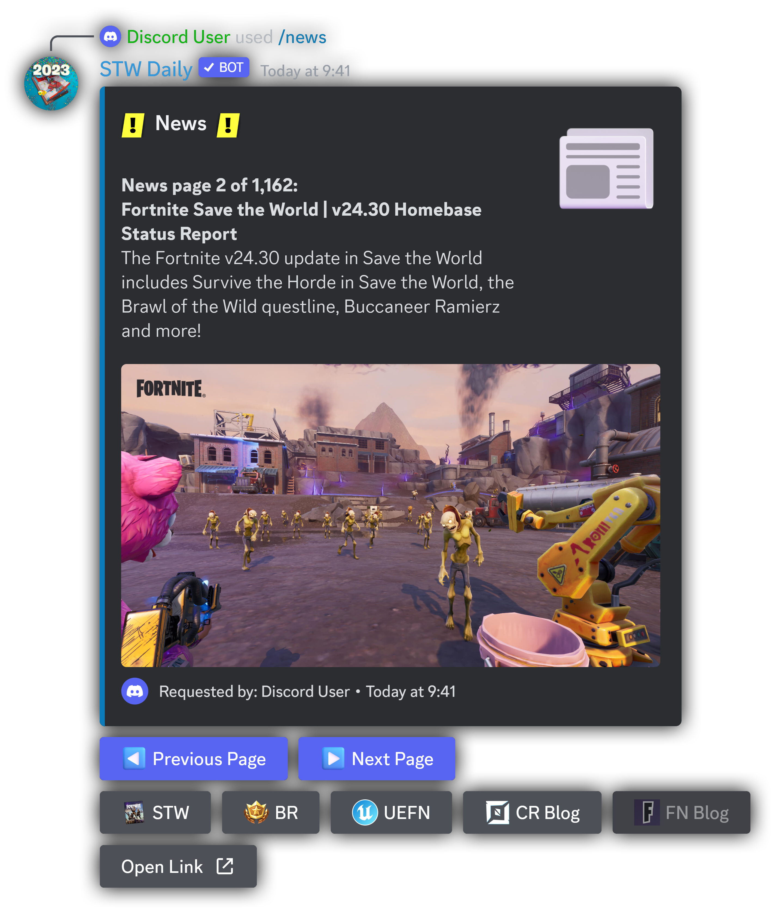
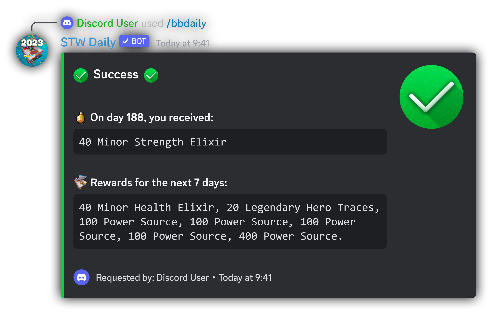

<br />
<div align=center>
    <a id="back-to-top"></a>
    <div align="center">
        <a href="https://github.com/dippyshere/stw-daily">
            
        
        </a>
    </div>
  <h4> A Discord bot for all of your Fortnite: Save the World needs</h4>
</div>

___

<h6 align=center> Claim daily rewards, research points, llamas, and more!</h6>
<div align=center>
<a href="https://discord.com/api/oauth2/authorize?client_id=757776996418715651&permissions=2147797056&scope=bot%20applications.commands"></a>
<a href="https://discord.gg/stw-dailies-757765475823517851"></a>

<a href="https://paypal.me/AHanson047"></a>
<a href="https://ko-fi.com/dippyshere"></a>
<h4>
<a href="#commands2">Commands</a>
•
<a href="#versions">Roadmap</a>
•
<a href="#roadmap">Requirements</a>
•
<a href="#development-guide">How to use</a>
•
<a href="#deployment">Support</a>
•
<a href="#contact">Credits</a>
•
<a href="#copyright">Info</a>
</h4>
</div>  

___


___

## Commands <a id="commands2"></a>

<details open>
    <summary><b>Information</b></summary>
    <ul>
    <span>There are two ways to use commands with STW Daily:</span>
        <ol>
            <li>Mentioning the bot:</li>
        <div>
            <picture>
              <source media="(prefers-color-scheme: dark)" srcset="res/stwmentiondark.svg" type="svg">
              <source media="(prefers-color-scheme: light)" srcset="res/stwmentionlight.svg" type="svg">
              
            </picture> <sup>{command} {parameters}</sup>
        <li>
            Using <a href="https://discord.com/blog/slash-commands-are-here" target="_blank">slash commands</a>:
        </li>
        <kbd>/{command}</kbd>
        </div>
        </ol>
        <br>
        <p>To use a command you want, replace {command} with the name of the command, and {parameters} with any parameters needed.
        <br>When mentioning the bot to invoke a command, a single space is required between the mention and the command. This is usually added for you.</p>
        <p><b>Click on the names of commands below to see examples of how to use them.</b></p>
    </ul>
</details>

___
<details>
    <summary><b>Daily</b></summary>
    <ul>
    <p>This command will instantly claim your daily reward, if available. To use this command, you'll need Fortnite: Save the World on the account you will claim with.</p>
    <span>There are two ways to use this command:</span>
        <ol>
            <li>Mentioning the bot:</li>
        <div>
            <picture>
              <source media="(prefers-color-scheme: dark)" srcset="res/stwmentiondark.svg" type="svg">
              <source media="(prefers-color-scheme: light)" srcset="res/stwmentionlight.svg" type="svg">
              
            </picture> <sup>daily {token} {opt-out}</sup>
        <li>
            Using <a href="https://discord.com/blog/slash-commands-are-here" target="_blank">slash commands</a>:
        </li>
        <kbd>/daily token:{token} auth_opt_out:{opt-out}</kbd>
        </div>
        <br>
        </ol>
        <p>Replace {token} with your auth code. You can find out more about this <a href="#how-to-get-a-code">here.</a> This parameter is optional—if you do not give an auth code the bot will return links needed for getting an auth code.<br><br>Replacing {opt-out} with any text will opt you out of the authentication system. Learn more about authentication sessions by checking out the <a href="#auth">auth command.</a></p> 
        <p><b>Examples:</b></p>
        <picture>
              <source media="(prefers-color-scheme: dark)" srcset="res/stwmentiondark.svg" type="svg">
              <source media="(prefers-color-scheme: light)" srcset="res/stwmentionlight.svg" type="svg">
              
        </picture> <sup>daily a51c1f4d35b1457c8e34a1f6026faa35</sup>
        <br><span> This will claim your daily reward, and will automatically start an authentication session.</span>
        <br><br><picture>
              <source media="(prefers-color-scheme: dark)" srcset="res/stwmentiondark.svg" type="svg">
              <source media="(prefers-color-scheme: light)" srcset="res/stwmentionlight.svg" type="svg">
              
        </picture> <sup>d a51c1f4d35b1457c8e34a1f6026faa35 yes</sup>
        <br><span> This will claim your daily reward, and will not create an authentication session.</span>
    </ul>
    
<p align="right"><a href="#commands2"></a></p>
</details>

<details>
    <a id="auth"></a>
    <summary><b>Auth</b></summary>
    <ul>
    <p>This command will log you in with Epic Games and start an <a href="https://github.com/dippyshere/stw-daily/wiki">authentication session</a> with STW Daily. This will keep you logged in for ~8 hours</p>
    <span>There are two ways to use this command:</span>
        <ol>
            <li>Mentioning the bot:</li>
        <div>
            <picture>
              <source media="(prefers-color-scheme: dark)" srcset="res/stwmentiondark.svg" type="svg">
              <source media="(prefers-color-scheme: light)" srcset="res/stwmentionlight.svg" type="svg">
              
            </picture> <sup>cmd {token} {opt-out}</sup>
        <li>
            Using <a href="https://discord.com/blog/slash-commands-are-here" target="_blank">slash commands</a>:
        </li>
        <kbd>/auth token:{token}</kbd>
        </div>
        <br>
        </ol>
        <p>Replace {token} with your auth code. You can find out more about this <a href="#how-to-get-a-code">here.</a> This parameter is optional—if you do not give an auth code the bot will return links needed for getting an auth code.</p> 
        <p><b>Examples:</b></p>
        <picture>
              <source media="(prefers-color-scheme: dark)" srcset="res/stwmentiondark.svg" type="svg">
              <source media="(prefers-color-scheme: light)" srcset="res/stwmentionlight.svg" type="svg">
              
        </picture> <sup>auth</sup>
        <br><span> This will provide you with links to get an auth code.</span>
        <br><br><picture>
              <source media="(prefers-color-scheme: dark)" srcset="res/stwmentiondark.svg" type="svg">
              <source media="(prefers-color-scheme: light)" srcset="res/stwmentionlight.svg" type="svg">
              
        </picture> <sup>auth a51c1f4d35b1457c8e34a1f6026faa35</sup>
        <br><span> This will log you in and authenticate you for ~8 hours.</span>
    </ul>
    
<p align="right"><a href="#commands2"></a></p>
</details>

<details>
    <summary><b>Help</b></summary>
    <ul>
    <p>This command provides an interactive interface to view all available commands, and help for how to use each command.</p>
    <span>There are two ways to use this command:</span>
        <ol>
            <li>Mentioning the bot:</li>
        <div>
            <picture>
              <source media="(prefers-color-scheme: dark)" srcset="res/stwmentiondark.svg" type="svg">
              <source media="(prefers-color-scheme: light)" srcset="res/stwmentionlight.svg" type="svg">
              
            </picture> <sup>help {command}</sup>
        <li>
            Using <a href="https://discord.com/blog/slash-commands-are-here" target="_blank">slash commands</a>:
        </li>
        <kbd>/help {command}</kbd>
        </div>
        <br>
        </ol>
        <p>Replace {command} with the name (or alias) of the specific command you want to view help for. This parameter is optional—not providing one will return all available commands.</p> 
        <p><b>Examples:</b></p>
        <picture>
              <source media="(prefers-color-scheme: dark)" srcset="res/stwmentiondark.svg" type="svg">
              <source media="(prefers-color-scheme: light)" srcset="res/stwmentionlight.svg" type="svg">
              
        </picture> <sup>help</sup>
        <br><span> This will return a list of available commands, and allow you to choose commands to view detailed help for.</span>
        <br><br><picture>
              <source media="(prefers-color-scheme: dark)" srcset="res/stwmentiondark.svg" type="svg">
              <source media="(prefers-color-scheme: light)" srcset="res/stwmentionlight.svg" type="svg">
              
        </picture> <sup>help auth</sup>
        <br><span> This will return detailed help for the auth command, and allow you to choose other commands to view detailed help for.</span>
    </ul>
    
<p align="right"><a href="#commands2"></a></p>
</details>

<details>
    <summary><b>Homebase</b></summary>
    <ul>
    <p>This command allows you to view / change the name of your Homebase in STW. You don't need STW to use, but the command is effectively useless without it.</p>
    <span>There are two ways to use this command:</span>
        <ol>
            <li>Mentioning the bot:</li>
        <div>
            <picture>
              <source media="(prefers-color-scheme: dark)" srcset="res/stwmentiondark.svg" type="svg">
              <source media="(prefers-color-scheme: light)" srcset="res/stwmentionlight.svg" type="svg">
              
            </picture> <sup>homebase {name} {token} {opt-out}</sup>
        <li>
            Using <a href="https://discord.com/blog/slash-commands-are-here" target="_blank">slash commands</a>:
        </li>
        <kbd>/homebase name:{name} token:{token} auth_opt_out:{opt-out}</kbd>
        </div>
        <br>
        </ol>
        <p>Replace {name} with the new name for your homebase. If your new name has spaces, wrap the name in <kbd>"</kbd> quotes (see examples below). This parameter is optional—if you leave it empty, the bot will display your current homebase name. Your new homebase name must:<ul><li>Be between 1-16 characters</li><li>Only contain alphanumerics (0-9, a-z) + additional characters ('-._~) + spaces</li></ul><br><br>Replace {token} with your auth code. You can find out more about this <a href="#how-to-get-a-code">here.</a> This parameter is optional—if you do not give an auth code the bot will return links needed for getting an auth code.<br><br>Replacing {opt-out} with any text will opt you out of the authentication system. Learn more about authentication sessions by checking out the <a href="#auth">auth command.</a> 
        <p><b>Examples:</b></p>
        <picture>
              <source media="(prefers-color-scheme: dark)" srcset="res/stwmentiondark.svg" type="svg">
              <source media="(prefers-color-scheme: light)" srcset="res/stwmentionlight.svg" type="svg">
              
        </picture> <sup>homebase</sup>
        <br><span> This will return your current homebase name (provided you are authenticated)</span>
        <br><br><picture>
              <source media="(prefers-color-scheme: dark)" srcset="res/stwmentiondark.svg" type="svg">
              <source media="(prefers-color-scheme: light)" srcset="res/stwmentionlight.svg" type="svg">
              
        </picture> <sup>hbrn "cool name" a51c1f4d35b1457c8e34a1f6026faa35</sup>
        <br><span> This will change your homebase name to <kbd>cool name</kbd>, and start an authentication session</span>
    </ul>
    
<p align="right"><a href="#commands2"></a></p>
</details>

<details>
    <summary><b>V-Bucks</b></summary>
    <ul>
    <p>This command will display your total V-Bucks, provide a breakdown on the source(s) of those V-Bucks, and additionally display how many X-Ray tickets you have.</p>
    <span>There are two ways to use this command:</span>
        <ol>
            <li>Mentioning the bot:</li>
        <div>
            <picture>
              <source media="(prefers-color-scheme: dark)" srcset="res/stwmentiondark.svg" type="svg">
              <source media="(prefers-color-scheme: light)" srcset="res/stwmentionlight.svg" type="svg">
              
            </picture> <sup>vbucks {token} {opt-out}</sup>
        <li>
            Using <a href="https://discord.com/blog/slash-commands-are-here" target="_blank">slash commands</a>:
        </li>
        <kbd>/vbucks token:{token} auth_opt_out:{opt-out}</kbd>
        </div>
        <br>
        </ol>
        <p>Replace {token} with your auth code. You can find out more about this <a href="#how-to-get-a-code">here.</a> This parameter is optional—if you do not give an auth code the bot will return links needed for getting an auth code.<br><br>Replacing {opt-out} with any text will opt you out of the authentication system. Learn more about authentication sessions by checking out the <a href="#auth">auth command.</a></p> 
        <p><b>Examples:</b></p>
        <picture>
              <source media="(prefers-color-scheme: dark)" srcset="res/stwmentiondark.svg" type="svg">
              <source media="(prefers-color-scheme: light)" srcset="res/stwmentionlight.svg" type="svg">
              
        </picture> <sup>vbucks a51c1f4d35b1457c8e34a1f6026faa35</sup>
        <br><span> This will start an authentication session and display your V-Bucks</span>
        <br><br><picture>
              <source media="(prefers-color-scheme: dark)" srcset="res/stwmentiondark.svg" type="svg">
              <source media="(prefers-color-scheme: light)" srcset="res/stwmentionlight.svg" type="svg">
              
        </picture> <sup>v</sup>
        <br><span> This will display your V-Bucks if authenticated, otherwise it will prompt you to authenticate.</span>
    </ul>
    
<p align="right"><a href="#commands2"></a></p>
</details>

<details>
    <summary><b>Research</b></summary>
    <ul>
    <p>This command allows you to claim your available research points, view your FORT research levels, and upgrade those levels. Press the button corresponding with the stat you wish to upgrade to upgrade it.</p>
    <span>There are two ways to use this command:</span>
        <ol>
            <li>Mentioning the bot:</li>
        <div>
            <picture>
              <source media="(prefers-color-scheme: dark)" srcset="res/stwmentiondark.svg" type="svg">
              <source media="(prefers-color-scheme: light)" srcset="res/stwmentionlight.svg" type="svg">
              
            </picture> <sup>research {token} {opt-out}</sup>
        <li>
            Using <a href="https://discord.com/blog/slash-commands-are-here" target="_blank">slash commands</a>:
        </li>
        <kbd>/research token:{token} auth_opt_out:{opt-out}</kbd>
        </div>
        <br>
        </ol>
        <p>Replace {token} with your auth code. You can find out more about this <a href="#how-to-get-a-code">here.</a> This parameter is optional—if you do not give an auth code the bot will return links needed for getting an auth code.<br><br>Replacing {opt-out} with any text will opt you out of the authentication system. Learn more about authentication sessions by checking out the <a href="#auth">auth command.</a></p> 
        <p><b>Examples:</b></p>
        <picture>
              <source media="(prefers-color-scheme: dark)" srcset="res/stwmentiondark.svg" type="svg">
              <source media="(prefers-color-scheme: light)" srcset="res/stwmentionlight.svg" type="svg">
              
        </picture> <sup>res</sup>
        <br><span> This will claim your available research points, and then allow you to spend them, if you are authenticated. If not, the bot will provide you with links to authenticate.</span>
        <br><br><picture>
              <source media="(prefers-color-scheme: dark)" srcset="res/stwmentiondark.svg" type="svg">
              <source media="(prefers-color-scheme: light)" srcset="res/stwmentionlight.svg" type="svg">
              
        </picture> <sup>research a51c1f4d35b1457c8e34a1f6026faa35 yes</sup>
        <br><span> This will This will claim your available research points, and then allow you to spend them. An authentication session will not be created</span>
    </ul>
    
<p align="right"><a href="#commands2"></a></p>
</details>

<details>
    <summary><b>News</b></summary>
    <ul>
    <p>This command will fetch and display the latest news from the game. You can switch between viewing Save the World or Battle Royale news by pressing the corresponding buttons. Cycle between pages by pressing the left/right arrow buttons.</p>
    <span>There are two ways to use this command:</span>
        <ol>
            <li>Mentioning the bot:</li>
        <div>
            <picture>
              <source media="(prefers-color-scheme: dark)" srcset="res/stwmentiondark.svg" type="svg">
              <source media="(prefers-color-scheme: light)" srcset="res/stwmentionlight.svg" type="svg">
              
            </picture> <sup>news {page} {mode}</sup>
        <li>
            Using <a href="https://discord.com/blog/slash-commands-are-here" target="_blank">slash commands</a>:
        </li>
        <kbd>/news page:{page} mode:{mode}</kbd>
        </div>
        <br>
        </ol>
        <p>Replace {page} with a page number to view. This parameter is optional—leaving it blank will show page one.<br>Replace {mode} with either stw, or br to view the news for the respective game mode. This parameter is optional—leaving it blank will show STW news.</p> 
        <p><b>Examples:</b></p>
        <picture>
              <source media="(prefers-color-scheme: dark)" srcset="res/stwmentiondark.svg" type="svg">
              <source media="(prefers-color-scheme: light)" srcset="res/stwmentionlight.svg" type="svg">
              
        </picture> <sup>news</sup>
        <br><span> This will display page 1 of the news for Save the World. Interact with the buttons to change pages / modes.</span>
        <br><br><picture>
              <source media="(prefers-color-scheme: dark)" srcset="res/stwmentiondark.svg" type="svg">
              <source media="(prefers-color-scheme: light)" srcset="res/stwmentionlight.svg" type="svg">
              
        </picture> <sup>news 1 br</sup>
        <br><span> This will show page 1 of the news for Battle Royale. Interact with the buttons to change pages / modes.</span>
    </ul>
    
<p align="right"><a href="#commands2"></a></p>
</details>

<details>
    <summary><b>Reward</b></summary>
    <ul>
    <p>This command returns information about a specific day's reward, and the rewards that follow.</p>
    <span>There are two ways to use this command:</span>
        <ol>
            <li>Mentioning the bot:</li>
        <div>
            <picture>
              <source media="(prefers-color-scheme: dark)" srcset="res/stwmentiondark.svg" type="svg">
              <source media="(prefers-color-scheme: light)" srcset="res/stwmentionlight.svg" type="svg">
              
            </picture> <sup>reward {day} {future-days}</sup>
        <li>
            Using <a href="https://discord.com/blog/slash-commands-are-here" target="_blank">slash commands</a>:
        </li>
        <kbd>/reward day:{day} limit:{future-days}</kbd>
        </div>
        <br>
        </ol> 
        <p>Replace {day} with the day you want to view the reward of. If you have an authentication session active, the day will be your current day unless you specify a day.<br><br>Replace {future-days} with the amount days you would like to see. </p> 
        <p><b>Examples:</b></p>
        <picture>
              <source media="(prefers-color-scheme: dark)" srcset="res/stwmentiondark.svg" type="svg">
              <source media="(prefers-color-scheme: light)" srcset="res/stwmentionlight.svg" type="svg">
              
        </picture> <sup>reward</sup>
        <br><span> This will display the reward for your current day and 7 days after, if authenticated. If you aren't authenticated, you must specify a day.</span>
        <br><br><picture>
              <source media="(prefers-color-scheme: dark)" srcset="res/stwmentiondark.svg" type="svg">
              <source media="(prefers-color-scheme: light)" srcset="res/stwmentionlight.svg" type="svg">
              
        </picture> <sup>rwrd 336 21</sup>
        <br><span> This will display the reward for day 336, and additionally the rewards for day 337-358 (21 days).</span>
    </ul>
    
<p align="right"><a href="#commands2"></a></p>
</details>

<details>
    <summary><b>Battle Breakers Daily</b></summary>
    <ul>
    <p>This command will claim your daily reward in Battle Breakers.</p>
    <span>There are two ways to use this command:</span>
        <ol>
            <li>Mentioning the bot:</li>
        <div>
            <picture>
              <source media="(prefers-color-scheme: dark)" srcset="res/stwmentiondark.svg" type="svg">
              <source media="(prefers-color-scheme: light)" srcset="res/stwmentionlight.svg" type="svg">
              
            </picture> <sup>bbd {token} {opt-out}</sup>
        <li>
            Using <a href="https://discord.com/blog/slash-commands-are-here" target="_blank">slash commands</a>:
        </li>
        <kbd>/bbdaily token:{token} auth_opt_out:{opt-out}</kbd>
        </div>
        <br>
        </ol>
        <p>Replace {token} with your auth code. You can find out more about this <a href="#how-to-get-a-code">here.</a> This parameter is optional—if you do not give an auth code the bot will return links needed for getting an auth code.<br><br>Replacing {opt-out} with any text will opt you out of the authentication system. Learn more about authentication sessions by checking out the <a href="#auth">auth command.</a></p> 
        <p><b>Examples:</b></p>
        <picture>
              <source media="(prefers-color-scheme: dark)" srcset="res/stwmentiondark.svg" type="svg">
              <source media="(prefers-color-scheme: light)" srcset="res/stwmentionlight.svg" type="svg">
              
        </picture> <sup>bbdaily a51c1f4d35b1457c8e34a1f6026faa35</sup>
        <br><span> This will claim your Battle Breakers daily reward, and will create an authentication session.</span>
        <br><br><picture>
              <source media="(prefers-color-scheme: dark)" srcset="res/stwmentiondark.svg" type="svg">
              <source media="(prefers-color-scheme: light)" srcset="res/stwmentionlight.svg" type="svg">
              
        </picture> <sup>bbd</sup>
        <br><span> This will claim your Battle Breakers daily reward if authenticated, otherwise it will prompt you to authenticate.  </span>
    </ul>
    
<p align="right"><a href="#commands2"></a></p>
</details>

<details>
    <summary><b>Battle Breakers Reward</b></summary>
    <ul>
    <p>This command returns information about a specific day's reward, and the rewards that follow for Battle Breakers.</p>
    <span>There are two ways to use this command:</span>
        <ol>
            <li>Mentioning the bot:</li>
        <div>
            <picture>
              <source media="(prefers-color-scheme: dark)" srcset="res/stwmentiondark.svg" type="svg">
              <source media="(prefers-color-scheme: light)" srcset="res/stwmentionlight.svg" type="svg">
              
            </picture> <sup>bbreward {day} {future-days}</sup>
        <li>
            Using <a href="https://discord.com/blog/slash-commands-are-here" target="_blank">slash commands</a>:
        </li>
        <kbd>/bbreward day:{day} limit:{future-days}</kbd>
        </div>
        <br>
        </ol> 
        <p>Replace {day} with the day you want to view the reward of. If you have an authentication session active, the day will be your current day unless you specify a day.<br><br>Replace {future-days} with the amount days you would like to see. </p> 
        <p><b>Examples:</b></p>
        <picture>
              <source media="(prefers-color-scheme: dark)" srcset="res/stwmentiondark.svg" type="svg">
              <source media="(prefers-color-scheme: light)" srcset="res/stwmentionlight.svg" type="svg">
              
        </picture> <sup>bbreward</sup>
        <br><span> This will display the reward for your current day and 7 days after, if authenticated. If you aren't authenticated, you must specify a day.</span>
        <br><br><picture>
              <source media="(prefers-color-scheme: dark)" srcset="res/stwmentiondark.svg" type="svg">
              <source media="(prefers-color-scheme: light)" srcset="res/stwmentionlight.svg" type="svg">
              
        </picture> <sup>bbr 336 21</sup>
        <br><span> This will display the reward for day 336, and additionally the rewards for day 337-358 (21 days).</span>
    </ul>
    
<p align="right"><a href="#commands2"></a></p>
</details>

<details>
    <summary><b>Info</b></summary>
    <ul>
    <p>This command will return various bits of information about the bot, which you may find interesting as a developer.</p>
    <span>There are two ways to use this command:</span>
        <ol>
            <li>Mentioning the bot:</li>
        <div>
            <picture>
              <source media="(prefers-color-scheme: dark)" srcset="res/stwmentiondark.svg" type="svg">
              <source media="(prefers-color-scheme: light)" srcset="res/stwmentionlight.svg" type="svg">
              
            </picture> <sup>info</sup>
        <li>
            Using <a href="https://discord.com/blog/slash-commands-are-here" target="_blank">slash commands</a>:
        </li>
        <kbd>/info</kbd>
        </div>
        <br>
        </ol>
        <p>The info command also provides a convenient way to verify the authenticity of the bot you are using. If the bot does <b>not</b> have a verified bot tag, or contains a message other than "✅Official Verified Deployment", DO NOT use that bot. The bot may have been tampered with, or may be a skid. Use of that bot may put your account at risk/inhibit the development of STW Daily. Learn more <a>here.</a></p>
    </ul>
    
<p align="right"><a href="#commands2"></a></p>
</details>

___

The official source code of the Discord
Bot [STW Daily](https://discord.com/api/oauth2/authorize?client_id=757776996418715651&permissions=2147797056&scope=bot%20applications.commands)
, which can claim your STW daily reward. It is an adaptation of [this repository](https://github.com/Londiuh/fstwrc)
by [Londiuh](https://github.com/Londiuh/).

## Important Information

### Using Public Hosted one:

Either [join the server](https://discord.gg/Mt7SgUu)
or [invite the bot to your own server](https://discord.com/api/oauth2/authorize?client_id=757776996418715651&permissions=2147797056&scope=bot%20applications.commands)
, and run the commands you want. You can even do it in DMs with the bot if you want (but you need a mutual server with
it).

### Self Hosting:

- Clone the repo
- Install the dependencies below
- Add token for your bot as an environment variable for "STW_DAILY_TOKEN"
- Invite your bot to your server
- Run "daily core.py"

### Skids:

[Super easy 1-click hosting method](https://media.tenor.com/AKkrwSZSpZ0AAAPo/talking-ben.mp4)

### FAQ

You can read some commonly asked questions about the bot on
the [STW Daily website](https://sites.google.com/view/stwdaily/docs/frequently-asked-questions)

## Requirements and dependencies

* Python 3 (Tested with 3.10.6)
* py-cord >= 2.1.1
* aiohttp < 3.9, >= 3.6.0
* psutil >= 5.9.1
    * Only used in the "info" command. It is not essential to the functionality of the bot and can/should be removed;
      but you need to remove the code that uses it yourself.
* An Epic Games account with campaign access (Fortnite: Save the world)

You can install the required dependencies with:

```
pip install -r requirements.txt
```

## How to start the bot

Set your bot token as the value for the environment variable "STW_DAILY_TOKEN", then run "daily core.py"

If you don't know what a bot token is or need one, you
can [create an application on discord](https://discord.com/developers/applications), then create a bot and copy it's
token.

Alternatively, you
can [Use my publicly one hosted on heroku here.](https://discord.com/api/oauth2/authorize?client_id=757776996418715651&permissions=2147797056&scope=bot%20applications.commands)

You can also [join my server](https://discord.gg/Mt7SgUu) if you would prefer to use the bot that way.


## How to use the bot

### @STW Daily {command} method

To interact with STW Daily, start your message by mentioning the bot (STW Daily), followed by the command you wish to
use. For example, to authenticate and claim a daily reward, you will now run `@STW Daily d {code}`, instead
of `stw d {code}`. Please note the space between the mention and the command.

You can learn more about all the new features and interactions STW Daily can provide by using `@STW Daily help`.

### / Slash command method

To get started with slash commands, start by typing `/`. You can learn more about slash
commands [here](https://discord.com/blog/slash-commands-are-here).

How to get a code
---
To get an auth
code [visit this website](https://www.epicgames.com/id/logout?redirectUrl=https%3A%2F%2Fwww.epicgames.com%2Fid%2Flogin%3FredirectUrl%3Dhttps%253A%252F%252Fwww.epicgames.com%252Fid%252Fapi%252Fredirect%253FclientId%253Dec684b8c687f479fadea3cb2ad83f5c6%2526responseType%253Dcode)
and sign in with your Epic Games account.

You will then be taken to an empty webpage, with your authcode being displayed at the top left.

```js
{
    "redirectUrl"
:
    "https://accounts.epicgames.com/fnauth?code=a51c1f4d35b1457c8e34a1f6026faa35", "authorizationCode"
:
    "a51c1f4d35b1457c8e34a1f6026faa35", "sid"
:
    null
}
```

Copy only the authorisation code (you can double-click it in most browsers), and then add that to your command.

``@STW Daily d a51c1f4d35b1457c8e34a1f6026faa35``

The auth code will expire shortly after issued, and if used by STW Daily, will immediately expire. If you require a new
code, you can
simply [refresh the page](https://www.epicgames.com/id/api/redirect?clientId=ec684b8c687f479fadea3cb2ad83f5c6&responseType=code)
to get a new code.

**NEW** in STW Daily beta: Authentication Sessions! Your authentication session will be saved for ~8 hours, allowing you
to claim a daily, claim your research points and spend them without needing a new code each time. You will still need to
provide a new code when the authentication session expires. You can opt out of automatically starting an authentication
session by specifying any text after your auth code, e.g. `@STW Daily d a51c1f4d35b1457c8e34a1f6026faa35 no`. You can
end an authentication session with `@STW Daily kill`

## Support

If you require help, just want to chat, or would prefer to use the bot in a different server to your own, you
can [join the STW Daily discord](https://discord.gg/Mt7SgUu). Feel free to reach out directly to us via the server.

## Credits

<a href="https://github.com/dippyshere/stw-daily/graphs/contributors">
  
</a>

[Londiuh](https://github.com/Londiuh) for their [code to collect daily rewards](https://github.com/Londiuh/fstwrc)

[Epic Research](https://github.com/MixV2/EpicResearch/)

Icons by [dippyshere ;)](https://github.com/dippyshere)

## Info

> **Note** Valid auth codes may allow an attacker to compromise your
> account.  [read more here](https://sites.google.com/view/stwdaily/docs/frequently-asked-questions)

###### <p align=center> Portions of the materials used are trademarks and/or copyrighted works of Epic Games, Inc. </p>

###### <p align=center> All rights reserved by Epic. </p>

###### <p align=center> This material is not official and is not endorsed by Epic. </p>

###### <p align=center> All badges/icons (except the "Llama Calendar") are original copyrighted works by the author. </p>

<div align="center">


</div>
